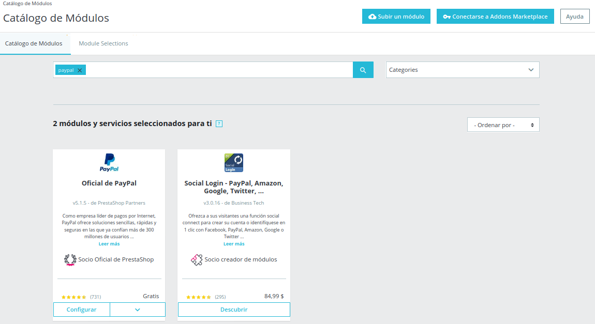
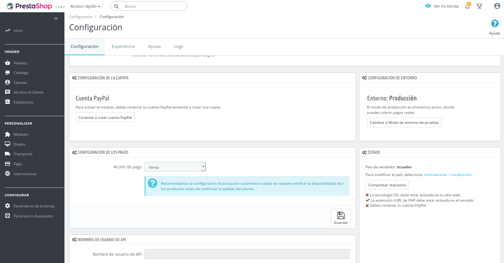
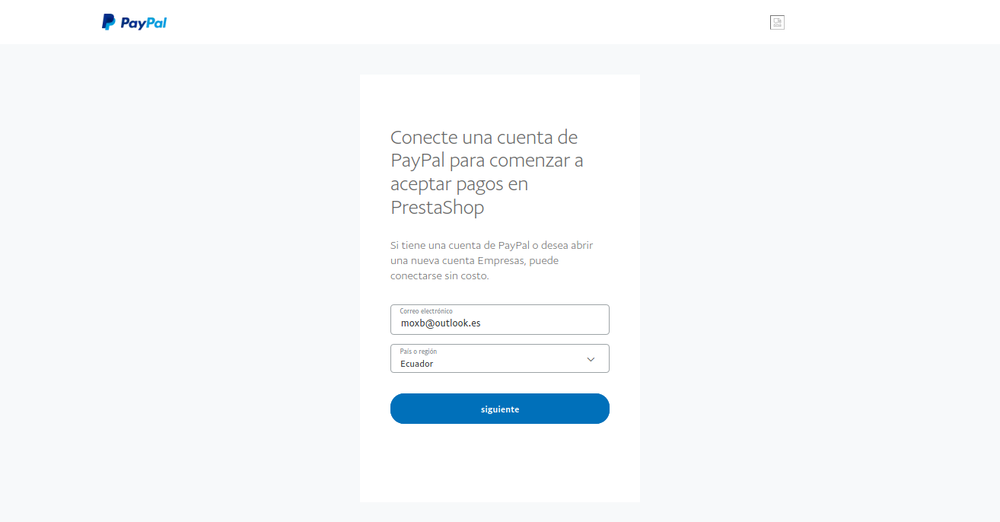
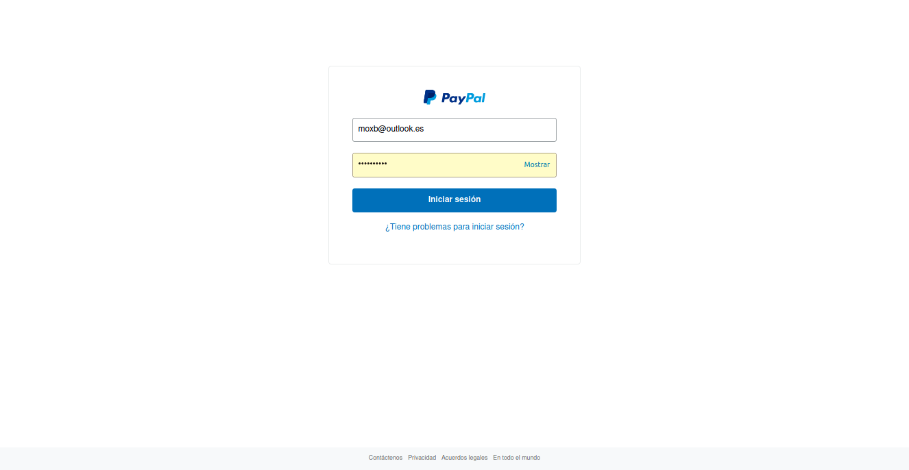
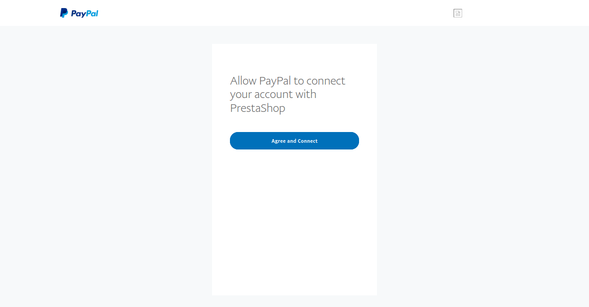
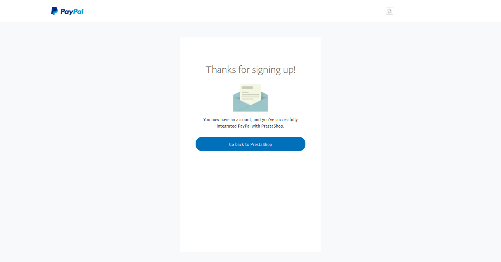
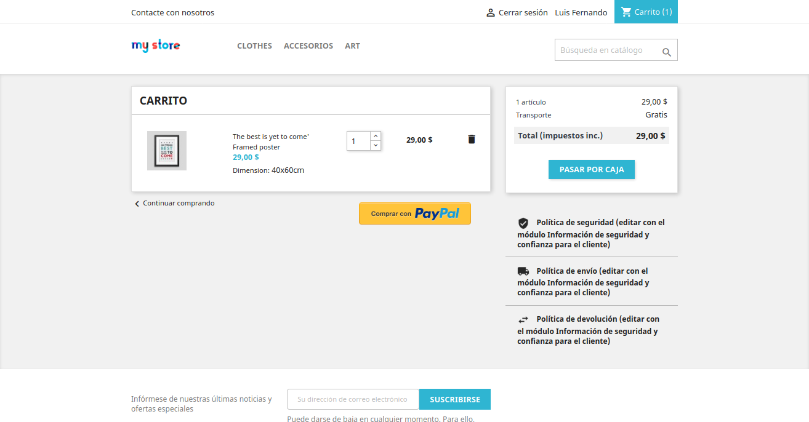

# INTEGRACIÓN DE PAYPAL EN PRESTASHOP

1. DIRIGIRSE A LA OPCION DE CATALOGO DE MÓDULOS DE LA TIENDA

- Buscar la opción de plugin de paypal e instalar
- Click en configurar

## CONFIGURACIÓN DEL PLUGIN

- Click en 'Conectar o crear cuenta con paypal' e Iniciar sesión con la cuenta de paypay

- Permitir conectar la cuenta de paypal con prestashop

## REALIZAR PRUEBAS

